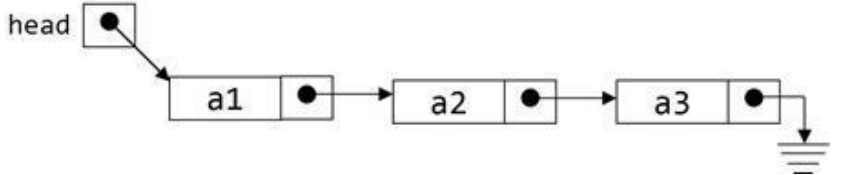

# Linked List

Imagine we have an array with five items: `[1, 2, 4, 5, 6]` and we want to insert a new element with the value `3` between the second and third element. We can't just insert the new element at the third position, because that would overwrite the current third element. Instead, we have create an new larger array, move the third, fourth and fifth element one position to the right, so that we can insert the new element at the third position.

This insertion operation is very expensive, because we have to move a lot of elements. The same is true for deleting an element. If we delete the third element, we have to move the fourth and fifth element one position to the left.

> Guess what, this is not always true, the pervious paragraph is a good intro to a beginner but it is not always the case. Watch this <https://www.youtube.com/watch?v=cvZArAipOjo>

Linked lists are a data structure that solves this problem. A linked list is a sequence of nodes. Each node contains a *value* and a *reference* to the next node.

# Types of Linked Lists

## Singly Linked Lists

A singly linked list is a linked list where each node (except the last node) only has a reference to the next node. This is the most common type of linked list.

## Doubly Linked Lists

A doubly linked list is a linked list where each node has a reference to the *next* and the *previous* node. This allows you to traverse the list in both directions.

## Circular Linked Lists

A circular linked list is a linked list where each node has a reference to the next node. The last node of the list has a reference to the first node (or the head) of the list. (similar to a single linked list but the last node points to the first node)

# Linked List Elements

- Head: The first node in a linked list.
- Tail: The last node in a linked list.
- Node: An object containing a value and a reference to the next node.
- Value: The value contained in a node.
- Pointer: A reference to another node.

# Singly Linked List



For a single linked list, you should test three cases before you submit your code:

- Zero nodes / Empty list
- One node
- General case (two or more nodes)

The various operations on a singly linked list are:

- Insertion
- Deletion
- Searching
- Printing the list
- Reversing the list

We cannot use the head to traverse the list, because we would lose the reference to the nodes. Instead, we use a temporary variable `currentNode` to traverse the list.

```go
type List struct {
    head *Node
    count int
}

type Node struct {
    value int
    next *Node
}
```

## Size of the List

```go
func (list *List) Size() int {
    return list.count
}
```

## `IsEmpty` Method

```go
func (list *List) IsEmpty() bool {
    return list.count == 0
}
```

## Insertion

Insertion is the process of adding a new node to the list. There are three cases we have to consider:

- Insertion at the beginning of the list
- Insertion at the end of the list
- Insertion in the Nth position of the list
- Insertion in sorted order

### Insertion at the Beginning of the List

```go
func (list *List) AddHead(value int) {
    list.head = &Node{value, list.head}
    list.count++
}
```

### Insertion at the End of the List

(Assuming there are no tail pointer)

```go
func (list *List) AddTail(value int) {
    newNode := &Node{value, nil}
    current := list.head

    if current == nil {
        list.head = newNode
        list.count++
        return
    }

    for current.next != nil {
        current = current.next
    }

    current.next = newNode
    list.count++
}
```

### Print the List

```go
func (list *List) Print() {
    for node := list.head; node != nil; node = node.next {
        fmt.Println(node.value)
    }
}
```

Now you can test your code with the following code:

```go
func main() {
    list := &List{} // or list := new(List)
    list.AddHead(1)
    list.AddHead(2)
    list.AddHead(3)
    list.AddHead(4)
    list.AddHead(5)
    list.Print()
}
```

### Insertion in the sorted order

```go
func (list *List) AddSorted(value int) {
    newNode := &Node{value, nil}
    current := list.head

    if current == nil || current.value > value {
        newNode.next = list.head
        list.head = newNode
        list.count++
        return
    }

    for current.next != nil && current.next.value < value {
        current = current.next
    }

    newNode.next = current.next
    current.next = newNode
    list.count++
}
```

## Searching

```go
func (list *List) IsPresent(value int) bool {
    for temp := list.head; temp != nil; temp = temp.next {
        if temp.value == value {
            return true
        }
    }
    return false
}
```

## Deletion

```go
func (list *List) DeleteHead() (int, error) {
    if list.IsEmpty() {
        return 0, errors.New("Empty list")
    }

    value := list.head.value
    list.head = list.head.next // garbage collector will remove the old head
    list.count--
    return value, nil
}
```

Delete node given the value

```go
func (list *List) DeleteNode(value int) bool {
    if list.IsEmpty() {
        return false
    }

    if list.head.value == value {
        list.head = list.head.next
        list.count--
        return true
    }

    for temp := list.head.next; temp != nil; temp = temp.next {
        if temp.next.value == value {
            temp.next = temp.next.next
            list.count--
            return true
        }
    }
    return false
}
```

Delete all occurrences of a given value

```go
func (list *List) DeleteNodes(value int) {
    if list.head == nil {
        return
    }

    for temp := list.head; temp.next != nil; {
        if temp.next.value == value {
            temp.next = temp.next.next
            list.count--
        } else {
            temp = temp.next
        }
    }
}
```

Delete the entire list

```go
func (list *List) DeleteList() {
    list.head = nil
    list.count = 0
    // garbage collector will remove the entire list
}
```

# Reverse a linked list

```go
func (list *List) Reverse() {
	current := list.head
	var previous, next *Node
	for current != nil {
		next = current.next
		current.next = previous
		previous = current
		current = next
	}

	list.head = previous
}
```

# Remove duplicates from linked list

```go
func (list *List) RemoveDuplicates() {
	current := list.head
	for current != nil {
		if current.next != nil && current.value == current.next.value {
			current.next = current.next.next
		} else {
			current = current.next
		}
	}
}
```

# Copy into another linked list

```go
func (list *List) Copy() *List {
	var headNode *Node

	copyList := new(List)

	current := list.head

	if current == nil {
		copyList.head = nil
		return copyList
	}

	headNode = &Node{current.value, nil}

	tempNode := headNode

	for current != nil {
		tempNode.value = current.value
		if current.next != nil {
			tempNode.next = &Node{0, nil}
		}
		current = current.next
		tempNode = tempNode.next
	}

	copyList.head = headNode

	return copyList
}
```

# Compare List

```go
func (list1 *List) Compare(list2 *List) bool {
	current1 := list1.head
	current2 := list2.head

	for {
		if current1 == nil && current2 == nil {
			return true
		}
		if current1 == nil || current2 == nil || current1.value != current2.value {
			return false
		}
		current1 = current1.next
		current2 = current2.next
	}
}
```

# Find Length

```go
func (list *List) Length() int {
	return list.count
}
```

# Nth Node from Beginning

```go
func (list *List) at(index int) (int, error) {
	if index < 0 || index > list.Length() {
		return 0, errors.New("index out of bound")
	}
	current := list.head
	for i := 0; i < index; i++ {
		current = current.next
	}

	return current.value, nil
}
```
