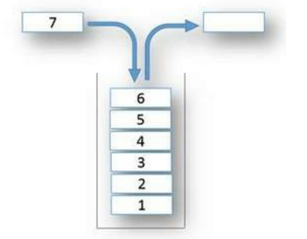

# Stack

Stack is a data structure that follows the LIFO (Last In First Out) principle. The last element added to the stack will be the first element removed from the stack.

The real like analogy of a stack is a stack of plates. The last plate added to the stack will be the first plate removed from the stack.

Note that stack only allows access to the top element of the stack. You cannot access elements in the middle of the stack.



A common use case of the stack is the call stack. When a function is called, the function is added to the call stack. When the function returns, the function is removed from the call stack.

Another use case is the undo operation in text editors. When you undo an operation, the operation is popped from the stack and the previous operation is applied.

Web browsers also use stacks to store the history of visited pages. When you click the back button, the last page is popped from the stack and displayed.

# The stack abstract data type

The stack abstract data type (ADT) is defined by the following structure and operations. A stack is a collection of elements that are added and removed according to the LIFO principle. The stack operations are:

- `Push(element)`: Add an element to the top of a stack
- `Pop()`: Remove an element from the top of a stack
- `Top()`: Get the top element of the stack without removing it
- `IsEmpty()`: Check if the stack is empty
- `Size()`: Get the number of elements in the stack

Stack can be implemented using an array or a linked list.

# Stack using slices

```go
