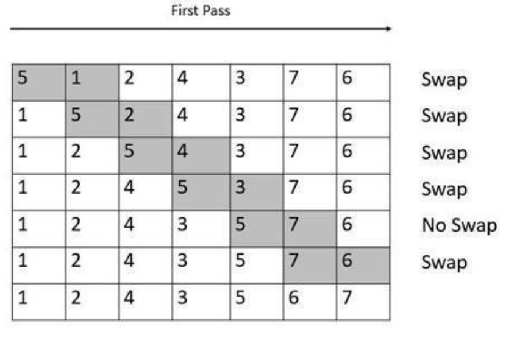
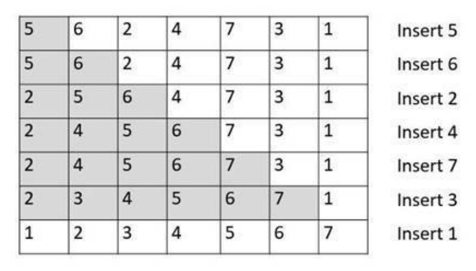
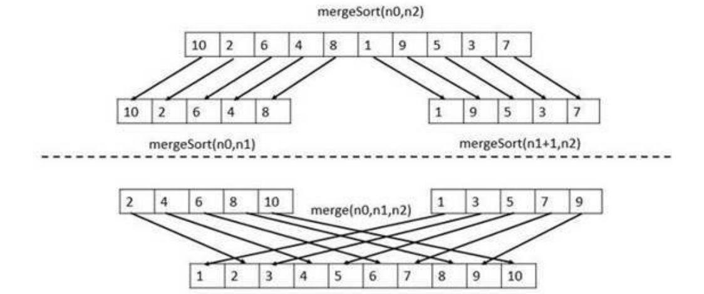
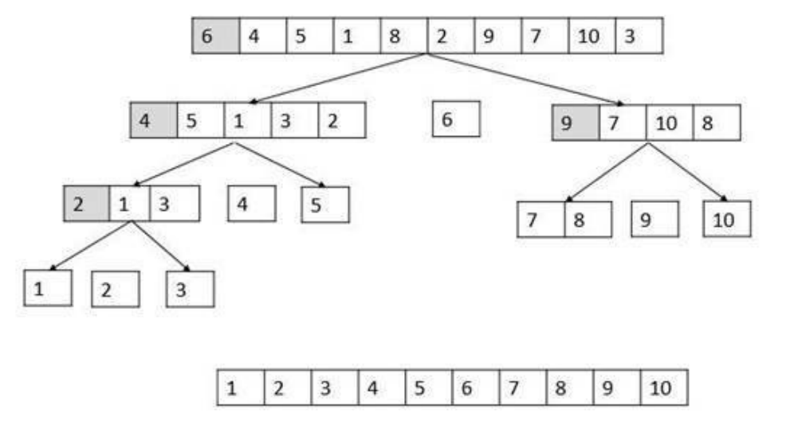
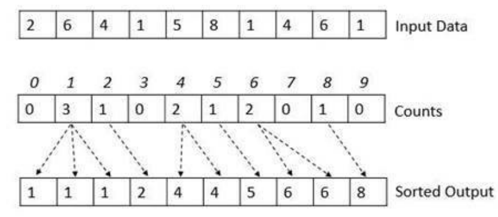
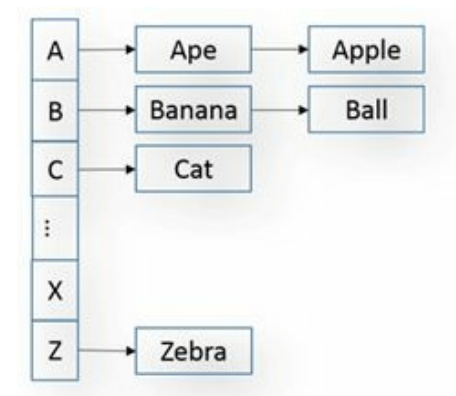

# Sorting

sorting is the process of arranging items in a specific order. Sorting algorithms specify the way to arrange data.

Algorithms like bubble sort, insertions sort and selection sort are the most basic sorting algorithms. They are easy to implement ans suitable for small data sets.

Merge sort, quick sort and heap sort are more advanced sorting algorithms and suitable for large data sets.

# Bubble Sort

Bubble sort is a simple sorting algorithm. This sorting algorithm is comparison-based algorithm in which each pair of adjacent elements is compared and the elements are swapped if they are not in order.



code:

```go
package main

import "fmt"

func main() {
	var arr = []int{8, 2, 10, 9, 7, 5, 3, 1, 6, 4, 0}
	fmt.Println("Initial array is:", arr)
	BubbleSort(arr)
	fmt.Println("Sorted array is: ", arr)
}

func BubbleSort(array []int) {
	for i := 0; i < len(array)-1; i++ {
		for j := 0; j < len(array)-i-1; j++ {
			if array[j] > array[j+1] {
				array[j], array[j+1] = array[j+1], array[j]
			}
		}
	}
}

```

Bubble sort is not a practical sorting algorithm. It is one of the slowest sorting algorithms. worst case complexity is of Ο(n^2).

## Modified Bubble Sort

The above function always runs O(n^2) time even if the array is sorted. It can be optimized by stopping the algorithm if inner loop didn’t cause any swap.

```go
package main

import "fmt"

func main() {
    var arr = []int{8, 2, 10, 9, 7, 5, 3, 1, 6, 4, 0}
    fmt.Println("Initial array is:", arr)
    BubbleSort(arr)
    fmt.Println("Sorted array is: ", arr)
}

func BubbleSort(array []int) {
    for i := 0; i < len(array)-1; i++ {
        swapped := false
        for j := 0; j < len(array)-i-1; j++ {
            if array[j] > array[j+1] {
                array[j], array[j+1] = array[j+1], array[j]
                swapped = true
            }
        }
        if swapped == false {
            break
        }
    }
}
```

By applying this optimization, the best case complexity becomes Ο(n).

# Insertion Sort

Insertion sort is a simple sorting algorithm. This sorting algorithm is comparison-based algorithm in which the array is split into two parts, the sorted part at the left end and the unsorted part at the right end. Initially, the sorted part consists of just the first element at the index 0. Then we pick up the next element from the unsorted part and place it at the correct position in the sorted part. This process continues until there are no more elements left in the unsorted part.



code:

```go
package main

import "fmt"

func main() {
	var arr = []int{8, 2, 10, 9, 7, 5, 3, 1, 6, 4, 0}
	fmt.Println("Initial array is:", arr)
	InsertionSort(arr)
	fmt.Println("Sorted array is: ", arr)
}

func InsertionSort(array []int) {
	var temp, i, j int
	for i = 1; i < len(array); i++ {
		temp = array[i]
		for j = i; j > 0; j-- {
			if temp < array[j-1] {
				array[j] = array[j-1]
			} else {
				break
			}
		}
		array[j] = temp
	}
}
```

Insertion sort worst case complexity is Ο(n^2).

# Selection Sort

Selection sort searches the whole array searching for the largest element and places it at the end of the array. Then it searches the remaining array for the second largest element and places it at the second last position and so on.

code:

```go
package main

import "fmt"

func main() {
	var arr = []int{8, 2, 10, 9, 7, 5, 3, 1, 6, 4, 0}
	fmt.Println("Initial array is:", arr)
	SelectionSort(arr)
	fmt.Println("Sorted array is: ", arr)
}

func SelectionSort(array []int) {
	var maximumElementIndex int
	for i := 0; i < len(array)-1; i++ {
		maximumElementIndex = 0
		for j := 0; j < len(array)-i-1; j++ {
			if array[j] > array[maximumElementIndex] {
				maximumElementIndex = j
			}
		}
		array[len(array)-i-1], array[maximumElementIndex] = array[maximumElementIndex], array[len(array)-i-1]
	}
}

```

Selection sort worst case complexity is Ο(n^2).

> Selection sort can be implemented by choosing the minimum element and replacing it in the beginning instead of maximum element.

# Merge Sort

Merge sort is a divide and conquer algorithm. It divides the input array into two halves, calls itself for the two halves, and then merges the two sorted halves. The `merge()` function is used for merging two halves. The `merge(arr, l, m, r)` is a key process that assumes that `arr[l..m]` and `arr[m+1..r]` are sorted and merges the two sorted sub-arrays into one.



code:

```go
package main

import "fmt"

func main() {
	var arr = []int{8, 2, 10, 9, 7, 5, 3, 1, 6, 4, 0}
	fmt.Println("Initial array is:", arr)
	MergeSort(arr)
	fmt.Println("Sorted array is: ", arr)

}

func MergeSort(array []int) {
	if len(array) <= 1 { // base case
		return
	}

	middle := len(array) / 2

	leftArray := make([]int, middle)
	rightArray := make([]int, len(array)-middle)

	copy(leftArray, array[:middle])
	copy(rightArray, array[middle:])

	fmt.Println("leftArray is:", leftArray)
	fmt.Println("rightArray is:", rightArray)
	MergeSort(leftArray)
	MergeSort(rightArray)

	Merge(leftArray, rightArray, array)
}

func Merge(leftArray []int, rightArray []int, array []int) {
	var i, j, k int

	for i < len(leftArray) && j < len(rightArray) {
		if leftArray[i] < rightArray[j] {
			array[k] = leftArray[i]
			i++
		} else {
			array[k] = rightArray[j]
			j++
		}
		k++
	}

	for i < len(leftArray) { // if rightArray is empty and there are still elements in leftArray
		array[k] = leftArray[i]
		i++
		k++
	}

	for j < len(rightArray) { // if leftArray is empty and there are still elements in rightArray
		array[k] = rightArray[j]
		j++
		k++
	}
}
```

Merge sort worst case complexity is Ο(nlogn).

# Quick Sort

Quick sort is a divide and conquer algorithm. It picks an element as pivot and partitions the given array around the picked pivot. There are many different versions of quickSort that pick pivot in different ways.

- Always pick first element as pivot.
- Always pick last element as pivot (implemented below)
- Pick pivot as the middle element.

The key process in quickSort is `partition()`. Target of partitions is, given an array and an element x of array as pivot, put x at its correct position in sorted array and put all smaller elements (smaller than x) before x, and put all greater elements (greater than x) after x. All this should be done in linear time.



code:

```go
package main

import "fmt"

func main() {
	var arr = []int{8, 2, 10, 9, 7, 5, 3, 1, 6, 4, 0}
	fmt.Println("Initial array is:", arr)
	QuickSort(arr, 0, len(arr)-1)
	fmt.Println("Sorted array is: ", arr)
}

func QuickSort(array []int, low int, high int) {
	if low >= high || high < 0 || low < 0 || len(array) == 0 {
		return
	}
	pivot := Partition(array, low, high)
	QuickSort(array, low, pivot-1)
	QuickSort(array, pivot+1, high)
}

func Partition(array []int, low int, high int) int {
	pivot := array[high] // pivot is the last element, can be assumed to any other element
	i := low
	for j := low; j < high; j++ {
		if array[j] < pivot {
			array[i], array[j] = array[j], array[i]
			i++
		}
	}
	array[i], array[high] = array[high], array[i]
	return i
}
```

Quick sort worst case complexity is Ο(n^2) and average case complexity is Ο(nlogn).

# Quick Select

Quick select is a selection algorithm to find the kth smallest element in an unordered list. It is related to the quick sort sorting algorithm but we ignore the one half of the partition and just focus on the part that contains the item we're interested in.

It is used to find the position of an element in a sorted array but without actually sorting the array.

code:

```go
package main

import "fmt"

func main() {
	var arr = []int{8, 2, 10, 9, 7, 5, 3, 1, 6, 4, 0}
	fmt.Println("Initial array is:", arr)
	fmt.Println("The position of 5 is:", QuickSelect(arr, 0, len(arr)-1, 5))
}

func QuickSelect(array []int, low int, high int, key int) int {
	if low > high || high < 0 || low < 0 || len(array) == 0 {
		return -1
	}
	pivot := Partition(array, low, high)

	if pivot == key {
		return array[pivot]
	} else if pivot > key {
		return QuickSelect(array, low, pivot-1, key)
	} else {
		return QuickSelect(array, pivot+1, high, key)
	}
}

func Partition(array []int, low int, high int) int {
	pivot := array[high] // pivot is the last element, can be assumed to any other element
	i := low
	for j := low; j < high; j++ {
		if array[j] < pivot {
			array[i], array[j] = array[j], array[i]
			i++
		}
	}
	array[i], array[high] = array[high], array[i]
	return i
}

```

Quick select worst case complexity is Ο(n^2) and average case complexity is Ο(n).

# Count Sort

Counting sort is a sorting technique based on keys between a specific range. It works by counting the number of objects having distinct key values (kind of hashing). Then doing some arithmetic to generate the sorted output. It is not a comparison based sorting. It running time complexity is Ο(n+k) where n is the number of elements in input array and k is the range of input. So it is the most efficient sorting algorithm.

Count sort is used when the range of the elements is known. e.g. sort the ages of a group of people. (age is between 0 and 100)



code:

```go
package main

import "fmt"

func main() {
	var arr = []int{23, 24, 22, 21, 26, 25, 27, 28, 21, 21}
	fmt.Println("Initial array is:", arr)
	CountSort(arr, 21, 28)
	fmt.Println("Sorted array is: ", arr)
}

func CountSort(array []int, min int, max int) {
	var countArray = make([]int, max-min+1) // Go automatically initializes the array with 0s
	for i := 0; i < len(array); i++ {
		countArray[array[i]-min]++
	}
	var index int
	for i := 0; i < len(countArray); i++ {
		for countArray[i] > 0 {
			array[index] = i + min
			index++
			countArray[i]--
		}
	}
}
```

Count sort worst case complexity is Ο(n+k) and average case complexity is Ο(n+k).

# Generalized Count Sort

There are cases when the element falling into a bucket are not unique but are in the same range. When we want to sort an index of a name, we can use the reference bucket to store names.



The buckets are already sorted and the elements inside each bucket can be kept sorted by using an sorting algorithm like insertion sort.

> Stable sort: A stable sort is one that has guaranteed not to reorder elements with identical keys.

# Selection of the best sorting algorithm

No sorting algorithm is best in all cases. It depends on the data set and the requirements.

**Quick Sort**:

- When you need a stable sort.
- When average complexity is more important than worst case complexity.
- i.e. when the data is random.

**Merge Sort**:

- When you need a stable sort.
- Faster algorithm (O(nlogn)).

**Insertion Sort**:

- When the data is small it performs better than merge sort and quick sort.
- When you need a stable sort.

**Bubble Sort**:

- When the data is nearly sorted. (for example, if there are two elements out of order in the array, bubble sort will swap them in two passes and then make another pass through the array to check if any other elements are out of order. If there are no more elements out of order, bubble sort will stop.)

**Selection Sort**:

- Worst performance among all the sorting algorithms.
- Only use for prototyping when you need a simple implementation of a sorting algorithm.

**Count Sort**:

- When the range of the elements is known.
- The best performance among all the sorting algorithms.
